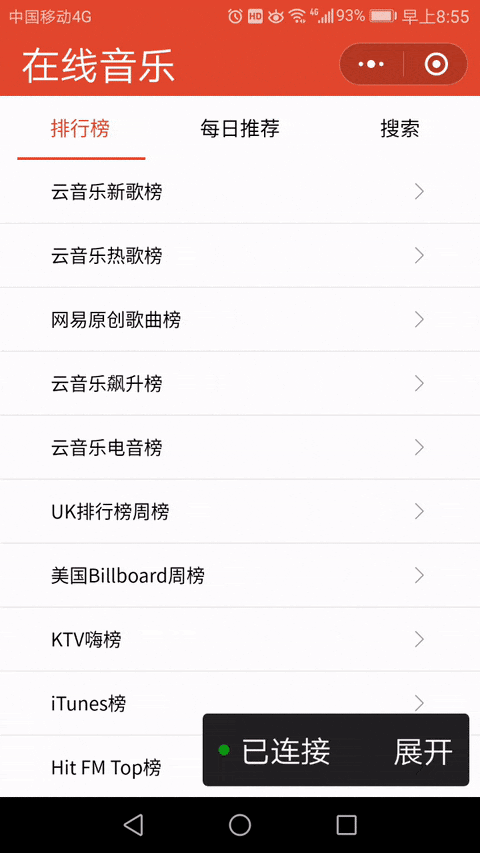

# wxMusic
微信小程序音乐，仿照的是网易云的安卓客户端APP  
     

## 效果预览


## 使用方法
将server目录拷贝放在你的域名服务器上，进入server端，运行
```js
node app.js
```
会启动一个服务器，然后将你的小程序的接口设置为你的域名，然后按照API的使用方法调取数据即可。设置方法如下：
```js
//在mixins下面的urls.js
baseUrl:"your api url"
```
然后使用安装`wepy-cli`在命令行下进入该目录:
```sh
wepy build --watch
```
然后打开微信小程序客户端开发工具，将`dist`目录作为项目根目录，即可运行(如果运行不成功注意勾选项目编译选项，比如ES6转ES5，不进行域名合法校验等)

## 依赖
- `wepy`腾讯的开源小程序框架
- `NeteaseCloudMusicApi`第三方的网易云音乐 Nodejs API，地址为[`NeteaseCloudMusicApi`](https://github.com/Binaryify/NeteaseCloudMusicApi)

## 学到的知识点
1. `scroll-view` 中的需要滑动的元素不可以用 `float` 浮动；
2. `scroll-view` 中的包裹需要滑动的元素的大盒子用 `display:flex;` 是没有作用的；
3. `scroll-view` 中的需要滑动的元素要用 `dislay:inline-block;` 进行元素的横向编排；
4. 包裹 `scroll-view` 的大盒子有明确的宽和加上样式-->  `overflow:hidden;white-space:nowrap;`
5. `swiper`组件必须放在最外层，并且不能使用任何嵌套，无法内嵌组件
6. `data-xxx`属性不能使用大写或者驼峰式写法，会被转换成小写
7. `Object.assign`只能进行浅拷贝，无法进行深拷贝，假如源对象的属性值是一个指向对象的引用，它也只拷贝那个引用值。
8. reducer中的state对象为引用对象时需要返回一个新对象，否则无法触发view重新渲染，例如数组就需要slice拷贝一份
9. `redux-actions`中的creatAction的types的名字不能一样否则会全部都dispatch
10. 可以使用自定义编译模式配置使得修改内容后不会再跳转到首页，而是跳到需要调试的页面
11. `getBackgroundAudioManager`方法官方说存在合法的src值就能获取，经测试无法立即取得，在onPlay函数也取不到，可以在`onTimeUpdate`中取得
12. 在onload中虽然能够打印出来connect的state的实时的新值,但是如果取值赋值的话还是之前的老的值不是新的值,也就是redux的state全局是唯一的不变的